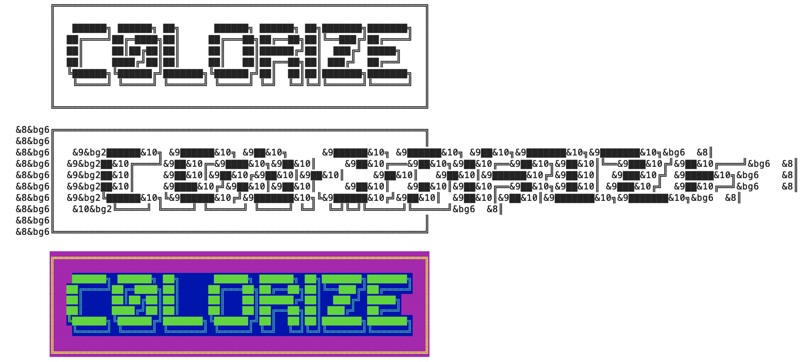

# c0lorize
Needed a little script to make generating things like irc MOTD's easier. Somewhat based off of [irc-colors](https://www.npmjs.com/package/irc-colors).

### Example


## Installation
```
git clone https://github.com/z0mbieparade/c0lorize.git
cd c0lorize
npm install
```

## To Use

add an ascii text file to the c0lorize directory that you want to color. c0lorize will replace the following strings:

### Colors
Any of the following color strings can be modified with &bg[color] to make it a background color, i.e: &white&bgblack would make white text on a black background.

- &0, &white 
- &1, &black 
- &2, &navy, &darkblue 
- &3, &green, &darkgreen
- &4, &red
- &5, &brown, &maroon
- &6, &purple, &violet
- &7, &olive, &orange
- &8, &yellow
- &9, &lightgreen, &lime
- &10, &teal
- &11, &cyan, &aqua
- &12, &blue, &royal
- &13, &pink, &lightpurple, &fuchsia
- &14, &gray, &grey
- &15, &lightgray, &lightgrey, &silver

### Styles
- &u, &underline
- &i, &italic
- &b, &bold
- &r, &reset

Check out the test.txt file for examples. Once you're done you can run:

```
node c0lorize.js
```
You will be prompted for:
- The file name (The default is test.txt in the c0lorize folder.) 
- If you would like to reset styling after each line
- If you would like to fix a bug with some irc clients viewing \\\ as \
- If you would also like to generate an HTML file
- If you would like to validate that HTML file (only asked if previous question is true)

It will then run and replace all your color codes with the correct escape codes and resave it in the same location as test_c0lorize.txt.

Optionally, you can also type:

```
node c0lorize.js somefile.txt true/false true/false true/false
```
This will pre-populate the prompts and it can make it a bit easier if you're repetitively re-running the script to make tweaks.